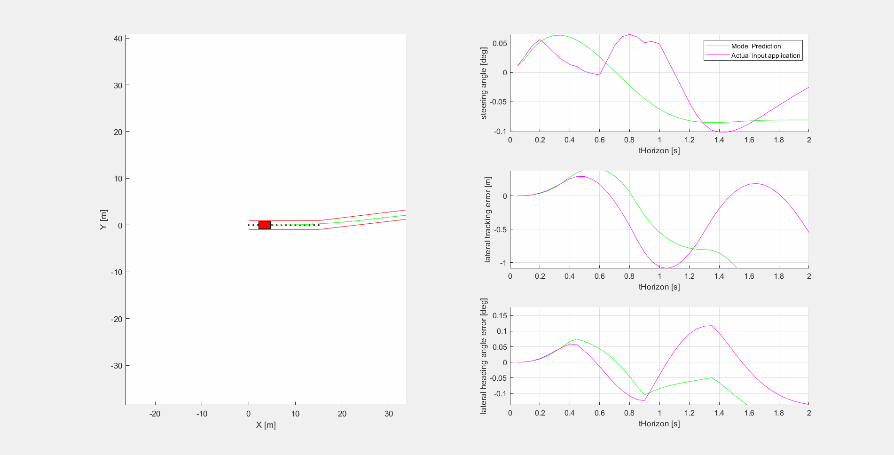

# Initial research on MPC and non lineal optimisation for real-time application.
This is a personal sandbox. Looking for computational speed, just comparing a few solvers:
1) CVX from Stanford
2) QuadProg from Matlab
3) [HPIPM](https://arxiv.org/abs/2003.02547)
4) Pending qpOASES

Obviously the first two lack speed compared to HPIPM, they are dense solvers. I love C. They all have matlab interfaces tho.

Used this library for splines, I had to create a wrapper around the functions. [SISL](https://github.com/SINTEF-Geometry/SISL)

I was lazy calculating Jacobians and Hessians, I let Matlab do all the heavy lifting when I should have used AD or something more sofisticated.

## Research

### Basic material and books 

[This book contains everything](https://sites.engineering.ucsb.edu/~jbraw/mpc/MPC-book-2nd-edition-2nd-printing.pdf)  
[Main reference](http://www.mpc.berkeley.edu/mpc-course-material)  
[Good material from italian professor](http://cse.lab.imtlucca.it/~bemporad/mpc_course.html)  

### Optimisation:
[General overview of optimal control problems](https://www.stardust2013.eu/Portals/63/Images/Training/OTS%20Repository/OTS-Talk-Topputo.pdf)  
[A few solvers evaluated. Some simplifications in calculation of theta](https://arxiv.org/pdf/1711.07300.pdf)  
[Approach QP](https://arxiv.org/pdf/1903.04240.pdf)
[From lineal to nonlinear MPC](https://www.researchgate.net/publication/308737646_From_linear_to_nonlinear_MPC_bridging_the_gap_via_the_real-time_iteration)  
[General overview of MPC, indirect/direct methods for transcription](https://repository.tudelft.nl/islandora/object/uuid:21edac7c-93b5-4140-bc28-663879f63108)  
[Good explaining the QP. Comparing the QP to Newton-Raphson method](https://ecal.berkeley.edu/files/ce191/CH02-QuadraticProgramming.pdf)  
[Solver: OpEn. Based on Rust](https://alphaville.github.io/optimization-engine/)  

### From Stanford, they tend to focus more on vehicle dynamics rather than optimisation:

[Vehicle formulation with trajectory error](https://arxiv.org/pdf/1903.08818.pdf)  
[Safe trajectories](https://www.sciencedirect.com/science/article/abs/pii/S0967066116300831)  
[Good second derivatives of e and d_phi. Decent stability analysis](https://ddl.stanford.edu/sites/g/files/sbiybj9456/f/publications/2012_Thesis_Kritayakirana_Autonomous_Vehicle_Control_at_the_Limits_of_Handling.pdf)  

### Vehicle dynamics:

[Basic vehicle dynamics](http://publications.lib.chalmers.se/records/fulltext/225751/local_225751.pdf)  

A bit more detail on the models:

[Model Predictive Stabilization Control of High-Speed Autonomous Ground Vehicles Considering the Effect of Road Topography](https://www.mdpi.com/2076-3417/8/5/822/pdf)  
[Vehicle Path Tracking LTV-MPC Controller Parameter Selection Considering CPU Computational Load](https://www.researchgate.net/publication/329438678_Vehicle_Path_Tracking_LTV-MPC_Controller_Parameter_Selection_Considering_CPU_Computational_Load)  
[Actual weight values are given here](https://iopscience.iop.org/article/10.1088/1742-6596/783/1/012028)  
[Model fidelity in MPCs](http://www-personal.umich.edu/~tersal/papers/paper30.pdf)  
[14 DOF vehicle](https://documents.pub/document/understanding-the-limitations-of-different-vehicle-models-for-roll-dynamics.html)  
[Comprehensive Phd thesis with 14-dof vehicle model. Some interesting thoughts about MPC in AV](https://www.researchgate.net/publication/335970485_Optimal_Coordination_of_Chassis_Systems_for_Vehicle_Motion_Control)  
[Roborace](https://github.com/TUMFTM/global_racetrajectory_optimization/blob/master/opt_mintime_traj/src/opt_mintime.py)  

### Stability:

[Mayne seems to be the reference](https://www.researchgate.net/publication/262364540_Correspondence_Correction_to_Constrained_model_predictive_control_stability_and_optimality)  
[More from Mayne](https://www.sciencedirect.com/science/article/pii/S0005109899002149)  
[Good definition of Lyapunov stability](https://www.sciencedirect.com/science/article/pii/S2405896316302191)  
[Good explanation of terminal cost and constraints to ensure stability/feasibility (sadly it only works with continious systems rather than discrete ones)](https://d-nb.info/1054135541/34)  
[More stabililty analysis from a vehicle dynamics point of view](https://ddl.stanford.edu/sites/g/files/sbiybj9456/f/publications/2011_Thesis_Beal_Applications_of_Model_Predictive_Control_to_Vehicle_Dynamics_for_Active_Safety_and_Stability.pdf)  

### Different approaches to MPC:
[Two proposal: 1) Non-linear MPC (solving non-linear optimization problem at each time step rather than horizon) and 2) LTV MPC](https://borrelli.me.berkeley.edu/pdfpub/pub-2.pdf)  
[Explicit MPC](https://www.ncbi.nlm.nih.gov/pmc/articles/PMC5849315/)  
[Switching error estimation](https://ieeexplore.ieee.org/document/8695742)  
[Interesting but probably not within the scope of this research, decentralised systems](https://citeseerx.ist.psu.edu/viewdoc/download?doi=10.1.1.328.4059&rep=rep1&type=pdf)  

